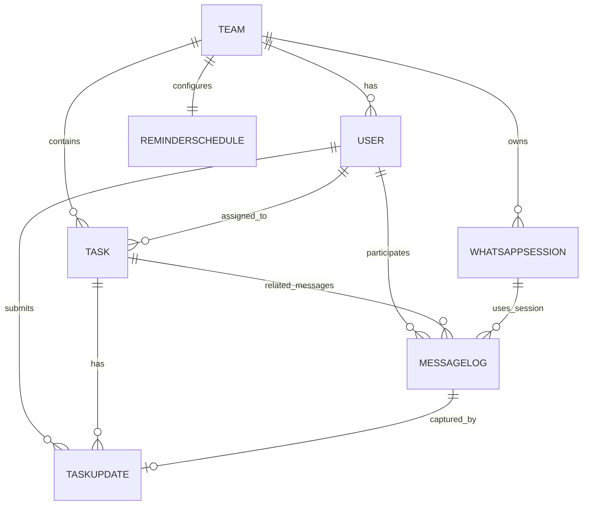

# Restrições da Interface do Baileys (O que armazenar)

- **Persistência de Credenciais e Chaves:** Persistir tanto `authState.creds` quanto todas as chaves de sinal (`signal keys`). O Baileys dispara `creds.update` a cada envio/recebimento, e chaves desatualizadas interrompem a entrega, portanto, as gravações no banco de dados devem ser síncronas/atômicas.
- **Armazenamento de Produção:** O armazenamento em múltiplos arquivos ("Multi-file file store") é desencorajado para produção devido ao alto I/O. O Baileys MD espera que você forneça seu próprio armazenamento baseado em banco de dados e implemente a lógica de reconexão.
- **Identificadores (JID) e Normalização:** O `remoteJid` utiliza dígitos no formato E.164 seguidos de `@s.whatsapp.net` (para indivíduos) ou `@g.us` (para grupos). Códigos de pareamento também exigem E.164 sem o simbolo "+", então armazene o telefone normalizado juntamente com o `remoteJid` por usuário para o mapeamento de mensagens recebidas.
- **Estado da Conexão e Logs:** O socket é descartável; o Baileys não mantém mais o estado do chat/mensagens. Portanto, devemos registrar logs de mensagens enviadas/recebidas e os motivos da última conexão/desconexão para permitir a recuperação após reinicializações.

## Diagrama Entidade-Relacionamento (ER)



## Schema do Banco de Dados (Prisma)

```prisma
// schema.prisma (PostgreSQL)
generator client {
  provider = "prisma-client-js"
}

datasource db {
  provider = "postgresql"
  url      = env("DATABASE_URL")
}

enum UserRole {
  LEAD
  DEV
}

enum TaskStatus {
  TODO
  IN_PROGRESS
  BLOCKED
  DONE
  REOPENED
}

enum TaskPriority {
  LOW
  MEDIUM
  HIGH
  CRITICAL
}

enum MessageStatus {
  QUEUED
  SENT
  DELIVERED
  READ
  FAILED
  ACK_PENDING
}

enum MessageDirection {
  OUTBOUND
  INBOUND
}

enum SessionStatus {
  ACTIVE
  NEEDS_QR
  DISCONNECTED
  ERROR
}

enum UpdateSource {
  WHATSAPP
  DASHBOARD
}

enum ReminderChannel {
  WHATSAPP
}

model Team {
  id           String            @id @default(uuid())
  name         String            @unique @db.VarChar(120)
  timezone     String            @default("UTC") @db.VarChar(50)
  isActive     Boolean           @default(true)
  users        User[]
  tasks        Task[]
  reminder     ReminderSchedule?
  sessions     WhatsAppSession[]
  messageLogs  MessageLog[]
  createdAt    DateTime          @default(now())
  updatedAt    DateTime          @updatedAt
}

model User {
  id           String       @id @default(uuid())
  team         Team         @relation(fields: [teamId], references: [id], onDelete: Cascade)
  teamId       String
  role         UserRole
  name         String       @db.VarChar(120)
  email        String       @db.VarChar(160)
  phoneNumber  String       @db.VarChar(20)
  remoteJid    String       @unique @db.VarChar(64)
  isActive     Boolean      @default(true)
  lastSeenAt   DateTime?
  tasks        Task[]       @relation("TaskAssignee")
  updates      TaskUpdate[]
  messageLogs  MessageLog[] @relation("UserMessageLogs")
  createdAt    DateTime     @default(now())
  updatedAt    DateTime     @updatedAt

  @@unique([teamId, email])
  @@unique([teamId, phoneNumber])
  @@index([phoneNumber])
  @@index([teamId, role])
}

model Task {
  id             String       @id @default(uuid())
  team           Team         @relation(fields: [teamId], references: [id], onDelete: Cascade)
  teamId         String
  assignee       User?        @relation("TaskAssignee", fields: [assigneeId], references: [id], onDelete: SetNull)
  assigneeId     String?
  title          String       @db.VarChar(200)
  description    String?
  priority       TaskPriority @default(MEDIUM)
  status         TaskStatus   @default(TODO)
  dueDate        DateTime?
  progressPercent Int          @default(0) @db.SmallInt
  blocked        Boolean      @default(false)
  blockedReason  String?
  lastReminderAt DateTime?
  nextReminderAt DateTime?
  completedAt    DateTime?
  archivedAt     DateTime?
  updates        TaskUpdate[]
  messageLogs    MessageLog[] @relation("TaskMessageLogs")
  createdAt      DateTime     @default(now())
  updatedAt      DateTime     @updatedAt

  @@index([assigneeId, status, dueDate])
  @@index([teamId, status])
  @@index([teamId, dueDate])
}

model TaskUpdate {
  id              String       @id @default(uuid())
  task            Task         @relation(fields: [taskId], references: [id], onDelete: Restrict)
  taskId          String
  user            User         @relation(fields: [userId], references: [id], onDelete: Restrict)
  userId          String
  progressPercent Int          @db.SmallInt
  statusSnapshot  TaskStatus
  blocked         Boolean      @default(false)
  blockedReason   String?
  source          UpdateSource @default(WHATSAPP)
  messageLog      MessageLog?  @relation("MessageLogToTaskUpdates", fields: [messageLogId], references: [id], onDelete: SetNull)
  messageLogId    String?
  createdAt       DateTime     @default(now())
  updatedAt       DateTime     @updatedAt

  @@index([taskId, createdAt])
  @@index([userId, createdAt])
}

model ReminderSchedule {
  id            String          @id @default(uuid())
  team          Team            @relation(fields: [teamId], references: [id], onDelete: Cascade)
  teamId        String          @unique
  time1Minutes  Int             @db.SmallInt // 0-1439 minutes from midnight
  time2Minutes  Int?            @db.SmallInt
  timezone      String          @db.VarChar(50)
  isActive      Boolean         @default(true)
  skipIfUpdated Boolean         @default(true)
  channel       ReminderChannel @default(WHATSAPP)
  lastRunAt     DateTime?
  createdAt     DateTime        @default(now())
  updatedAt     DateTime        @updatedAt

  @@index([timezone])
}

model MessageLog {
  id          String           @id @default(uuid())
  team        Team             @relation(fields: [teamId], references: [id], onDelete: Cascade)
  teamId      String
  session     WhatsAppSession? @relation(fields: [sessionId], references: [id], onDelete: SetNull)
  sessionId   String?
  user        User?            @relation("UserMessageLogs", fields: [userId], references: [id], onDelete: SetNull)
  userId      String?
  task        Task?            @relation("TaskMessageLogs", fields: [taskId], references: [id], onDelete: SetNull)
  taskId      String?
  direction   MessageDirection
  status      MessageStatus    @default(QUEUED)
  messageId   String           @db.VarChar(100) // WA message key id
  remoteJid   String           @db.VarChar(64)
  retries     Int              @default(0)
  payload     Json?
  errorCode   String?
  errorReason String?
  sentAt      DateTime?
  deliveredAt DateTime?
  readAt      DateTime?
  createdAt   DateTime         @default(now())
  updatedAt   DateTime         @updatedAt
  updates     TaskUpdate[]     @relation("MessageLogToTaskUpdates")

  @@unique([messageId, remoteJid])
  @@index([remoteJid, direction, status])
  @@index([teamId, createdAt])
  @@index([taskId, createdAt])
}

model WhatsAppSession {
  id               String        @id @default(uuid())
  team             Team          @relation(fields: [teamId], references: [id], onDelete: Cascade)
  teamId           String
  label            String        @db.VarChar(50)
  phoneNumber      String        @db.VarChar(20)
  remoteJid        String        @db.VarChar(64)
  status           SessionStatus @default(NEEDS_QR)
  isPrimary        Boolean       @default(true)
  creds            Json          // authState.creds serialized with BufferJSON
  keys             Json          // authState.keys serialized
  appVersion       String?       @db.VarChar(20)
  lastQrAt         DateTime?
  lastConnectedAt  DateTime?
  lastDisconnectAt DateTime?
  disconnectReason String?
  failureCount     Int           @default(0)
  messageLogs      MessageLog[]
  createdAt        DateTime      @default(now())
  updatedAt        DateTime      @updatedAt

  @@unique([teamId, label])
  @@unique([teamId, phoneNumber])
  @@index([teamId, status])
}
```
