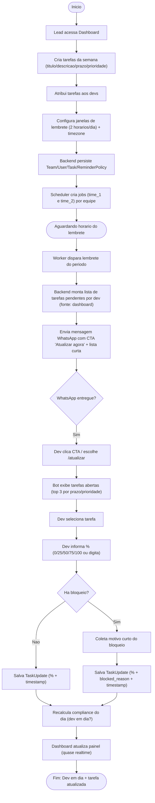

# Fluxos do Sistema (Updates de Tarefas via WhatsApp)

Este documento detalha todos os fluxos possíveis do sistema no padrão flowchart TD.

## 1) Fluxo Principal (Happy Path): Lembrete -> Update -> Compliance

## 2) Fluxo /hoje: Dev puxa status sem esperar lembrete

## 3) Fluxo /atualizar: Dev inicia update manualmente

## 4) Anti-fatigue: Segundo lembrete suprimido ou vira soft ping

## 5) Idempotencia: Evitar update duplicado no webhook

## 6) Fallback de texto ambíguo: 'nao entendi' -> fluxo guiado

## 7) Falha de entrega no WhatsApp: retry + log + alerta no dashboard

## 8) Dev ausente (ferias/folga): suspende cobrança automática

## 9) Tarefa concluída e reaberta: histórico preservado

## 10) Mudança de prioridade no dia: refletir sem flood

## 11) Escalonamento ao lead: ausencia recorrente (ex: 2 dias sem update)

## 12) Regra de compliance: definição de 'em dia' por dia útil

